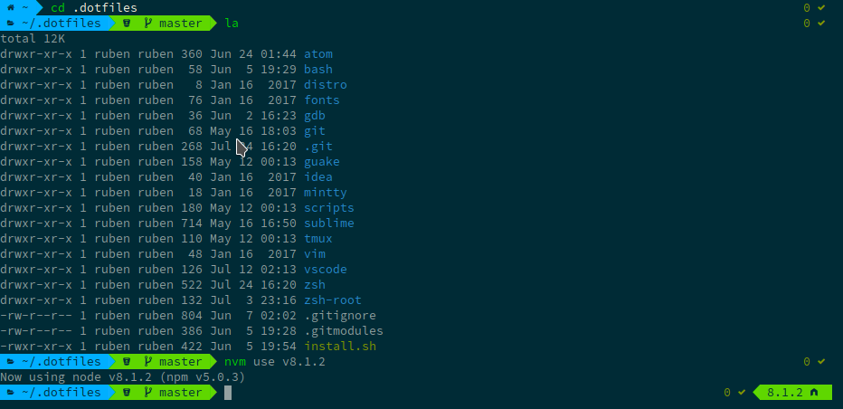
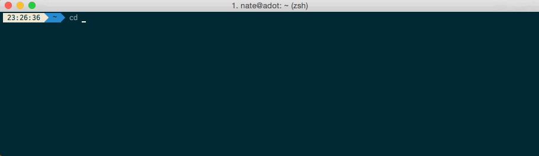
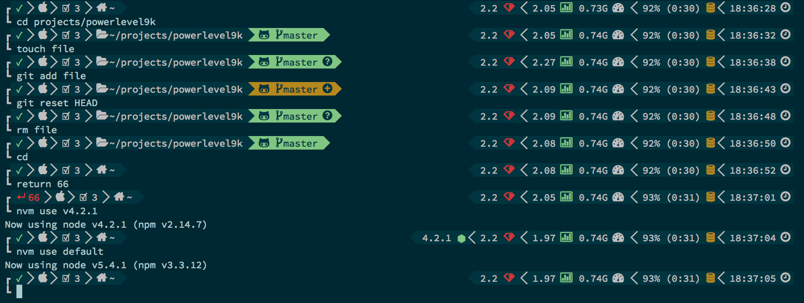

Modern programming involves an abusive amount of terminal usage.

* Test changes? Terminal.
* Launch server? Terminal.
* Commit changes? Terminal.
* Docker? Terminal.
* Anything else? Probably terminal...
* Using VIM? Always terminal.

Now imagine the core tool of your workflow looking like this:


Doesn't seem very pleasant, does it?

## It's all about the eye candy

Communities like [/r/unixporn](https://reddit.com/r/unixporn) (it's SFW for the record) aim to solve that issue, by providing eye candy for our trusty terminals:



Looks much better, right? But we can't stop now...



We need more statuses!



NOTE: Screenshots are from [Powerlevel9K's config showoff](https://github.com/bhilburn/powerlevel9k/wiki/Show-Off-Your-Config).

Overall a much better experience, except for all the overhead you get from running `git status` and `nvm version` every single time you press `ENTER`.

[Slow](https://github.com/bhilburn/powerlevel9k/issues/232) [terminal](https://github.com/bhilburn/powerlevel9k/issues/374) [response](https://github.com/bhilburn/powerlevel9k/issues/132) [issues](https://github.com/bhilburn/powerlevel9k/issues/314) [are](https://github.com/bhilburn/powerlevel9k/issues/244) [really](https://github.com/bhilburn/powerlevel9k/issues/287) [common](https://github.com/robbyrussell/oh-my-zsh/issues/4116), [even](https://github.com/powerline/powerline/issues/1280) [outside](https://github.com/powerline/powerline/issues/1543) [of](https://github.com/powerline/powerline/issues/104) [Powerlevel9K](https://groups.google.com/forum/#!topic/powerline-support/7WCkP1HgPTc).

It's not even about relatively fancy `nvm`/`rbenv` prompt segments. VCS segments add *a lot* of overhead in big repos.

This is how it looks like opening a Linux Kernel repo with most of its history deleted (only 14 commits):

<video src="/videos/sync-prompt.mp4" controls loop preload='auto'>
</video>

Granted, filesystem cache makes subsequent prompt redraws much faster, but there is still a 200-300ms delay that makes typing really annoying.

## Async will help us

Here is the list of async prompts I managed to find (feel free to add yours in the comments):

* [Pure](https://github.com/sindresorhus/pure)
* [Statusline](https://github.com/el1t/statusline)
* [Powerlevel9K's WIP async branch](https://github.com/bhilburn/powerlevel9k/pull/344)

NOTE: I'm going to use Powerlevel9K in this example purely because of aesthetics.

Instead of this in `antigernrc` (you can use whatever ZSH package manager you prefer):

```sh
POWERLEVEL9K_INSTALLATION_PATH=$ANTIGEN_BUNDLES/bhilburn/powerlevel9k
antigen theme bhilburn/powerlevel9k powerlevel9k
```

We are going to use the WIP branch with zsh-async:

```sh
#Async library
antigen bundle mafredri/zsh-async

#Theme
POWERLEVEL9K_INSTALLATION_PATH=$ANTIGEN_BUNDLES/dritter/powerlevel9k-async_all_the_segments/powerlevel9k.zsh-theme
antigen theme dritter/powerlevel9k powerlevel9k --branch=async_all_the_segments
```

Much better results!

<video src="/videos/async-prompt.mp4" controls loop preload='auto'>
</video>

As you might have noticed, VCS info isn't blocking us from typing into the terminal and executing commands. That's a huge usability improvement.

You can find my full zsh configuration [here](https://github.com/Vagr9K/dotfiles/tree/master/zsh).

Happy coding!
