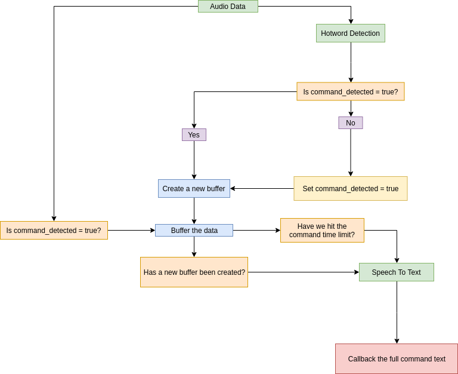
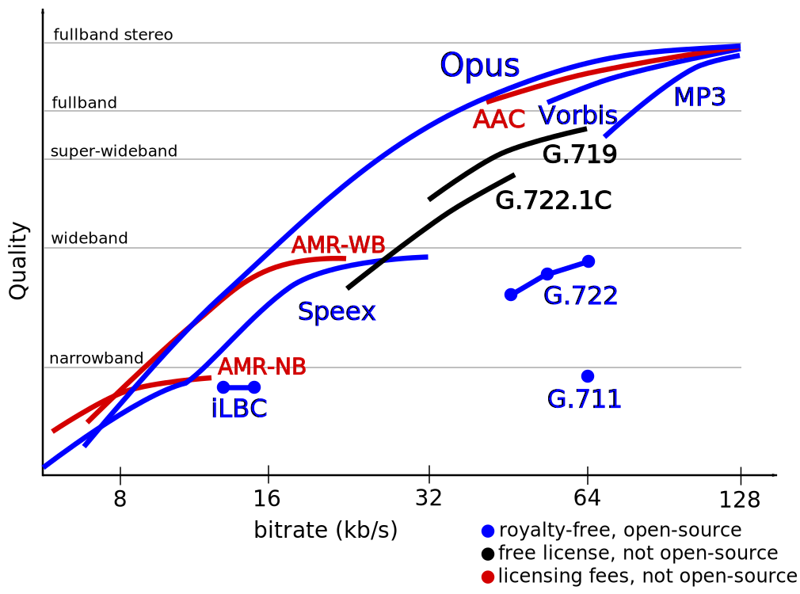
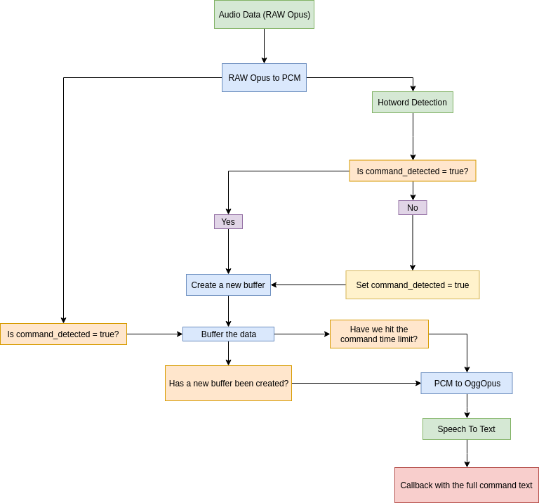
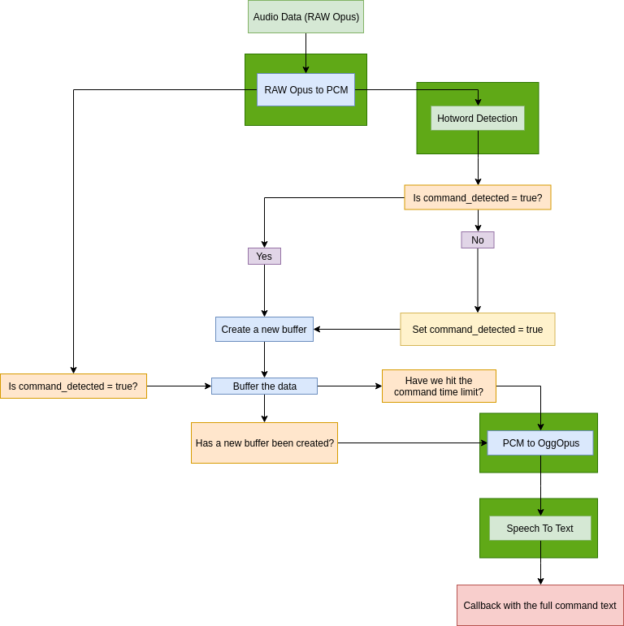
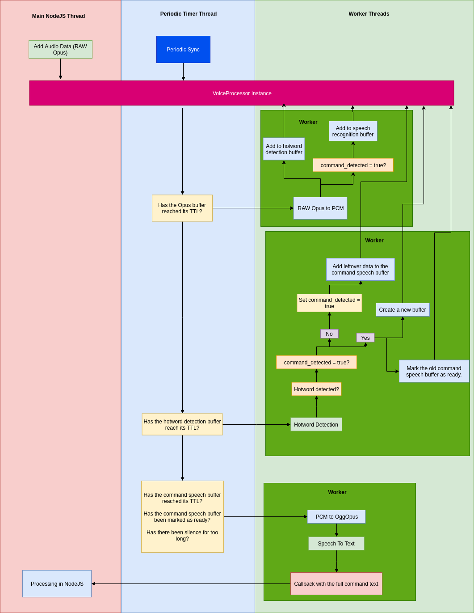

Have you ever wanted to just pronounce the song's name and let a Discord bot play it?

Today we will make our own "Alexa" for Discord.

## Demo

  <iframe id="ytplayer" type="text/html" width="640" height="360"
  src="https://www.youtube.com/embed/vRwp--RoJdo?autoplay=0&origin=https://vagr9k.me"
  frameborder="0"></iframe>

Why `Terminator`? It seems to be the most consistently detected hotword.

Why `Mozart`? It's not copyrighted.

## Code

You can find the native module code in [Vagr9K/native-voice-command-detector](https://github.com/Vagr9K/native-voice-command-detector).

The actual discord bot that utilizes this is located in [Vagr9K/VoiceBot](https://github.com/Vagr9K/VoiceBot).

## General implementation plan

First of all, let's break down the idea into smaller pieces.

There are effectively two main parts of our application:

- The main bot code that will be responsible for:
  - handling the Discord API
  - monitoring user actions for commands
  - responding to commands
- The voice command detection code

This might initially seem strange since the voice command detection code is technically a submodule of the main code, but due to its complexity, it's worth to split the problem into these pieces.

## Implementing the main code

The main code gets easily handled by a NodeJS based application.

Libraries like [discord.js](https://discord.js.org) and [ytdl](https://github.com/fent/node-ytdl) provide easy to use tooling to solve most of our problems.
Add [TypeScript](https://www.typescriptlang.org/) on top to get static typing, compile time checks and very convenient autocomplete based on the definitions of the aforementioned modules, and you're set.

The npm ecosystem greatly decreases the development time, while also lowering the entry bar for people with small programming experience, making it perfect for the audience of Discord.

From the performance perspective, these tasks aren't CPU intensive and mostly wait for the network, meaning that the [NodeJS event loop](https://nodejs.org/de/docs/guides/event-loop-timers-and-nexttick/) can handle them effectively without any extra optimizations being needed.

## Implementing the voice command detection

The naive implementation would consist of us piping the entire audio stream into a speech to text service and parsing the text.
Due to privacy concerns and pricing of these services, that's not ethically/economically practical.

It's reasonable to expect that voice commands will be less than 1% of the audio stream data, making the so called "hotword detection" a huge improvement in both regards.
After we've detected the hotword we only need to send a chunk of audio data for speech to text and later command extraction.

Keep in mind that the data that we will be receiving is a stream, meaning that after a hotword is detected we will have to redirect the next X seconds of data into a buffer, that will be later sent to a speech recognition service.

It's also worth noting that if a user pronounces another hotword while the previous one was being buffered, we need to create a new buffer for the new command and submit the old one for processing.

The next issue is that the hotword detector is buffering the data on its end too, and we'll have to submit the leftover data after the hotword detection to the command speech buffer to make sure that no command speech segments are lost.

This gives us the general logic of the application (data flow is from top to bottom):

### Picking the correct libraries

Let's start filling the blanks.

For Hotword detection, the [Porcupine](https://github.com/Picovoice/Porcupine) seems to be the best bet.
This is due to:

- Relatively permissive license
- Multitude of available ports
- High performance
- Hotword models can be generated on the fly (but can't be used commercially)

Ideally, [Precise](https://github.com/MycroftAI/mycroft-precise) would've been used, but it's Python only making things complicated, since it can't be as easily ported to NodeJS.

It's really hard to compare the speech to text services, but judging by the pricing and general feedback, the [GCloud Speech To Text](https://cloud.google.com/speech-to-text/) is a safe choice.

### Details, details, even more details

Here things get extra complicated.

First of all, we receive the audio data from Discord as RAW [Opus](https://opus-codec.org/) frames. Opus is a highly optimized audio codec that manages to provide high quality audio even at the lowest bitrates, making it optimal for network based voice communication.

Since the supported format for Porcupine is the signed 16 bit low endian PCM (single channel, 16K frequency), we need to first decode the data.
GCloud in its own turn supports S16LE, but due to network payload size concerns, it makes sense to first compress the data via encoding. As we've established before, Opus provides the best size/quality and is supported as [OggOpus on GCloud](https://cloud.google.com/speech-to-text/docs/reference/rest/v1/RecognitionConfig#AudioEncoding). The encoded audio data will also need to be `Base64` encoded and sent as a `JSON` payload by a `POST` request.

The updated diagram looks like this:

### Designing the correct architecture

Since the logical segment is done, we need to dive into the architecture.

- Option #1: Just write NodeJS code.

  This won't scale reliably due to the fact that encoding/decoding/hotword detection are CPU intensive tasks. Once we start blocking the event loop, [the performance of NodeJS will degrade very quickly](https://nodejs.org/de/docs/guides/dont-block-the-event-loop/). We won't be able to support multiple people speaking in real-time and massive delays will be ensured. Combine this with the fact that NodeJS is single threaded and the processing load can't be distributed between multiple logical CPU cores either.

  Unfortunately, in their current state the [worker threads](https://nodejs.org/api/worker_threads.html) are limited due to object serialization/deserialization restrictions. Namely when it comes to passing functions to worker threads.

- Option #2: Rely on native encoding/decoding libraries.

  Although the encoding/decoding gets sped up massively by using native modules like [node-opus](https://github.com/Rantanen/node-opus), we face the issue of `N-API -> JS` and `JS -> N-API` function call and argument copying overhead. This will mostly become a problem with the huge buffers. A couple seconds of speech is around 500+ 16bit Opus frames, which decode into 160K+ 16 bit PCM frames (~312KB of data). Combine it with each frame having to be submitted by invoking a native function (extra overhead for each call), things don't look as pretty. On top of that we're still limited to a single thread.

- Option N3: Submit all data to a native module that will process the rest.

  This way we don't deal with the overhead and have a full control over how and in which thread our code executes. Upon finishing the processing, we will invoke a callback with the full text to keep the N-API overhead at a minimum.

### Designing the parallelization

First of all, let's break down our app to _concurrent_ tasks to see which actions can be parallelized (notice the green rectangles):

This gives us a good idea over which tasks can be assigned to worker threads. The issue is that we're dealing with streams. Processing the buffers only when a new frame enters the module is problematic, since a user may pronounce his command and stay silent for the rest of the command's time limit, effectively hanging the system.

This means that our logic processing needs to be handled on periodic intervals by a separate lightweight thread, while worker threads execute the CPU intensive code.

This brings us to the final design:

The `VoiceProcessor` instance holds all the buffers and their states. Each audio stream (Discord user) gets his own instance.

The main NodeJS thread which originally invokes the native code is only used for submitting the Opus frames to the VoiceProcessor instance buffer. No processing is done during the submission, which keeps the event loop blocked for the minimal amount of time.

The periodic timer thread periodically calls the `Sync` function on each `VoiceProcessor` instance to perform the state processing on them. This ensures consistent latency irrelevant of the Opus frame submission rate. The main NodeJS thread is also unloaded and doesn't have to perform these actions.

Based on the timers and buffer states of the `VoiceProcessor`, Opus decoding, hotword detection and speech recognition are being invoked in separate worker threads to ensure maximum possible parallelization of work on all the available logical CPU cores.

## Benchmark

The benchmark was executed as follows:

- Prerecorded data is submitted
- It's submitted instantly and assigned different IDs each time to simulate multiple concurrent users
- Silence TTL is 1000ms, buffer TTL is 200ms, thus making the lowest possible callback time ~1400ms.
- GCloud network requests are skipped due to inconsistency they introduce
- Average callback delay is measured
- User count configurations are 1/10/50/100/150/200/250
- Worker thread configurations are 2th/4th/8th/16th
- The benchmark was run on a Ryzen 1800x (stock, 3200Mhz CL14 RAM)

Results:

| Time/Count | 2th  | 4th  | 8th  | 16th |
| ---------- | ---- | ---- | ---- | ---- |
| 1          | 1390 | 1423 | 1425 | 1425 |
| 10         | 1490 | 1446 | 1432 | 1434 |
| 50         | 1978 | 1707 | 1584 | 1556 |
| 100        | 2495 | 1970 | 1693 | 1620 |
| 150        | 3351 | 2282 | 1888 | 1751 |
| 200        | N/A  | 2544 | 1995 | 1854 |
| 250        | N/A  | 2907 | 2134 | 1964 |

Visualised:

We can clearly see that 2 worker threads are simply not enough to process everything in time. Considering that most modern CPU's support 6+ logical cores, this shouldn't be an issue.

8 worker threads seem to be the sweet spot.

## Conclusion

Voice command detection, even in its simplest form, is far from being easy. There are a lot of edge cases to consider and performance metrics to keep track of.

As of right now this is still an alpha stage project, but it shows that using N-API to handle the performance critical segments while keeping the simplicity of NodeJS for the rest of the project, effectively combines the best of both worlds.

This has been my "weekend project" for quite a while. If you think I've missed something, feel free to point it out.
