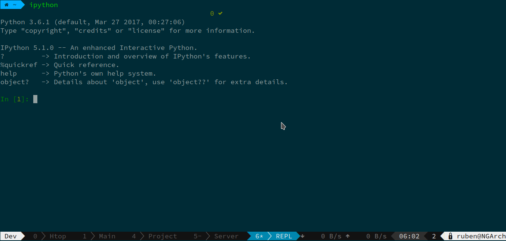

Many of you might have liked the appearance of powerline tmux theme, but the hassle of installing powerline and suffering possible performance degradation was not worth it.

In this article, I'm going to talk about theming Tmux to look like powerline.

For those of you interested in the end result, [here is file](https://github.com/Vagr9K/dotfiles/blob/master/tmux/powerline.tmuxtheme).

Source it in your `tmux.conf`.

Inspired by [Tmux themepack](https://github.com/jimeh/tmux-themepack/blob/master/powerline/default/cyan.tmuxtheme).

## Determining required features

We are mostly interested in:

* Indication of prefix keypress
* Powerline like window list
* Network usage indication
* Time
* Number of tmux clients
* Hostname
* Username

## Tmux theming 101

Update interval for the statusline is being set with `set -g status-interval SECONDS`.

Colors in Tmux config, are set using Xterm color codes. You can use [this cheatsheet](https://jonasjacek.github.io/colors/) to get the right color.

```sh
set -g status-fg colour240
set -g status-bg colour233
```

To theme theleft sattus bar, we are going to use variable like `client_prefix` and `#S`. Full list is available in `man tmux`.

Note the usage of powerline characters. As long as your terminal font supports them, you can just copy and paste them into your configuration file.

To set colors, use `#[bg=COLORCODE,fg=COLORCODE]` before the characters you want to recolor.

```sh
set -g status-left-bg colour233
set -g status-left-fg colour243
set -g status-left-length 40
set -g status-left "#{?client_prefix,#[fg=colour255]#[bg=colour31]#[bold] #S #[fg=colour31]#[bg=colour233],#[fg=colour232]#[bg=colour255]#[bold] #S #[fg=colour255]#[bg=colour233]}"
```

Same thing for the right side of the status bar.

```sh
set -g status-right-bg colour233
set -g status-right-fg colour243
set -g status-right-length 100
set -g status-right "#{net_speed} #[fg=colour236,bg=colour233]#[fg=colour255,bg=colour236] %H:%M #[fg=colour233,bg=colour236]#[fg=colour255,bg=colour233,bold] #{session_attached} #[fg=colour255,bg=colour233]#[fg=colour233,bg=colour255]  #(whoami)@#[fg=colour232,bg=colour255,bold]#H "
```

Window status (middle part) contains the list of your active windows. Set the display format using `set -g window-status-format "  #I#F  #W  "`.

```sh
set -g window-status-format "  #I#F  #W  "
set -g window-status-current-format "#[fg=colour233,bg=colour31]#[fg=colour255,bg=colour31] #I#F  #W #[fg=colour31,bg=colour233,nobold]"
```

And for the currently active window:

```sh
set -g window-status-current-bg colour39
set -g window-status-current-fg colour255
```

## Result



[Full file](https://github.com/Vagr9K/dotfiles/blob/master/tmux/powerline.tmuxtheme).
