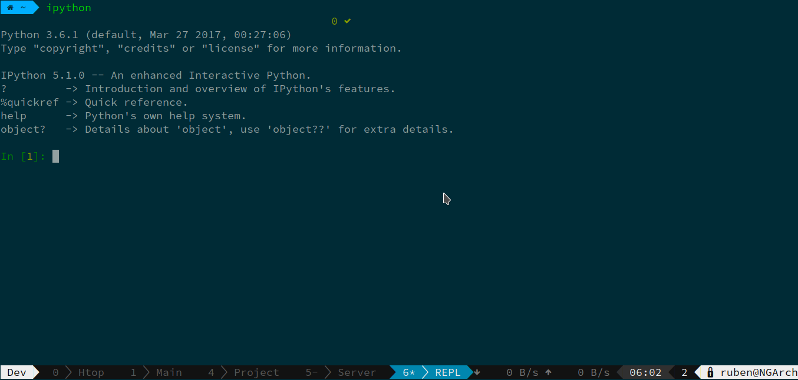

I'm a heavy tmux user. Mostly because of the way I launch and monitor my dev servers/compilers/transpilers while coding.

Configuring Tmux in a right way for your needs is really important if you want to have a distraction free workflow.

### Better Tmux prefix

Prefix key is, of course, going to be the most used one. Setting it right is crucial. For me `Meta-z` combination works really well, since both keys are easy to press and I don't use any other keybinds that can interfere with it.

```sh
# Better prefix
set -g prefix M-z
unbind C-b
bind M-z send-prefix
```

At some point you'll also face a sitution when you need to use the prefix key in nested sessions, so let's handle that too by setting `Meta-a` as a keybind.

```sh
# Nested Tmux keybinds
bind-key -n M-a send-prefix
```

### Pane navigation

Use Meta+arrow keys without prefix key to switch panes.

```sh
bind -n M-Left select-pane -L
bind -n M-Right select-pane -R
bind -n M-Up select-pane -U
bind -n M-Down select-pane -D
```

### Window navigation

Use shift+arrow keys to switch windows.

```sh
bind -n S-Left  previous-window
bind -n S-Right next-window
```

### Vim user specific keybinds

You can skip this part if you don't plan on using Vi/Vim or their keybinds. Otherwise comments are pretty self-explainatory.

```sh
# Instant vim-mode change
set -s escape-time 0

# Enable modifier keys in vim
set-option -g xterm-keys on

# Use vi keybinds
setw -g mode-keys vi
set -g status-keys vi
```

### Mouse support

You mostly shouldn't be using your mouse if you want to be *extra* productive, but sometimes using mouse wheel is nice.

```sh
# Mouse support
set -g mouse on
bind -n WheelUpPane   select-pane -t= \; copy-mode -e \; send-keys -M
bind -n WheelDownPane select-pane -t= \;                 send-keys -M
```

### Copy mode keybinds

This snippet creates a vi-like experience in copy mode.

```sh
# Copy mode settings
unbind p
bind p paste-buffer
bind -Tcopy-mode v send -X begin-selection
bind -Tcopy-mode y send -X copy-selection
```

### Increase the history size

```sh
# Bigger history
set -g history-limit 10000
```

### Change pane/window counting index

If you prefer keeping 0-index pane/window for special purposes, this might come in handy.

```sh
# Start counting windows/panes from 1
set -g base-index 1
setw -g pane-base-index 1
```

### Turn on the aggressive resize

When using the same session on multiple screens, you'll be limited by the smallest screen resolution on *all* screens. This can be mostly fixed by aggressive resize.

```sh
setw -g aggressive-resize on
```

### Use a plugin manager

[TPM](https://github.com/tmux-plugins/tpm) is a really great way of managing Tmux plugins.

I'm personally using the following ones:

* [Tmux Resurrect](https://github.com/tmux-plugins/tmux-resurrect) to restore the session after rebooting
* [Tmux Copycat](https://github.com/tmux-plugins/tmux-copycat) for regex bassed searches in copymode
* [Tmux net-speed](https://github.com/tmux-plugins/tmux-net-speed) to monitor network usage

```sh
##Plugins
set -g @plugin 'tmux-plugins/tpm'
set -g @plugin 'tmux-plugins/tmux-resurrect'
set -g @plugin 'tmux-plugins/tmux-copycat'
set -g @plugin 'tmux-plugins/tmux-net-speed'

##Plugin location
set-environment -g TMUX_PLUGIN_MANAGER_PATH '~/.dotfiles/tmux/plugins/'
##Init
run '~/.dotfiles/tmux/plugins/tpm/tpm'
```
## Themes

I'm using a custom Powerline-like tmux theme I've made myself.



You can read more about that in [Creating a native Powerline theme for Tmux](/creating-a-native-powerline-theme-for-tmux).

## Is it worth investing time into this?

If you are using SSH to manage multple computers/servers, or would like to emulate [Terminator](https://launchpad.net/terminator) like features in normal terminals, then yes.

Tmux also can be a good terminal workspace manager.

My full Tmux configuration is in [my dotfiles repo](https://github.com/Vagr9K/dotfiles/tree/master/tmux).
